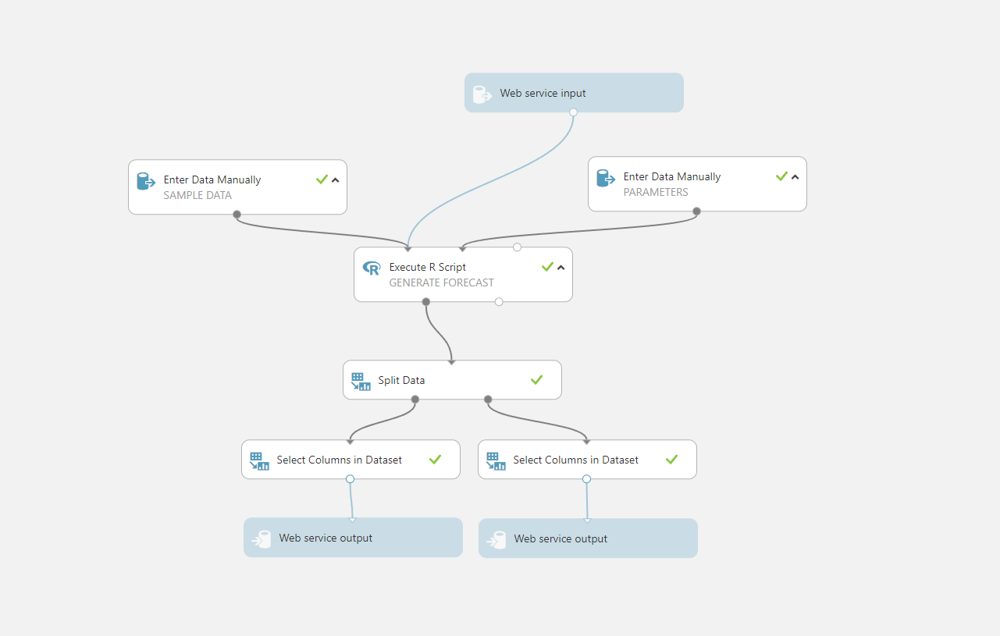
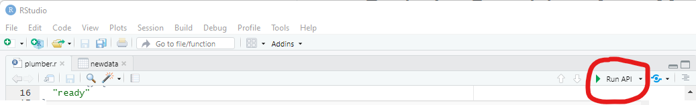
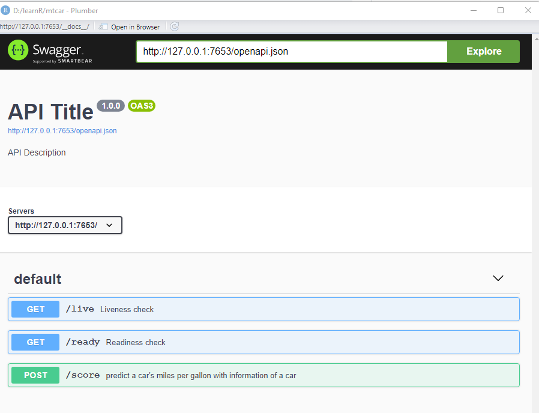

# Deploying R models as Azure Machine Learning managed online endpoints

One popular usage pattern of Machine Learning Studio(classic) is to deploy custom R script as a web service. Your origin experiment in ML Studio(classic) probably looks like below, the core logic of the web service is in **Exebute R Script**. 



In Azure Machine Learning, it's suggested to use [online endpoint](https://docs.microsoft.com/en-us/azure/machine-learning/concept-endpoints) to streamline model deployment for real-time scenario. We will use custom container feature of online endpoint to deploy your R model. 

This example use a very simple ridge regression model to walk you through the steps of deploying a R model. More about how the model is trained and mtcars dataset in [here](https://towardsdatascience.com/create-predictive-models-in-r-with-caret-12baf9941236). The model file is saved under ./scripts/model.rds 


Assume you have a R model and the script to make prediction using the model, below are the steps to deploy your R model as a mananged online endpoint uisng customer container feature.

1. Refactor your R script to web server and test locally
2. Build the container and test locally
3. Deploy the container as Azure Machine Learning managed online endpoint


## Pre-requisites
1. An Azure subscription. If you don't have an Azure subscription, [create a free account](https://aka.ms/AMLFree) before you begin.
2. A terminal. [Install and set up the AzureML CLI (v2)](https://docs.microsoft.com/azure/machine-learning/how-to-configure-cli) before you begin.
3. Make sure docker is installed in your local machine
1. Make sure R and RStudio is installed in your local machine. This example has been tested using R4.1.2. But any recent R version should work. You would also install "plumber" and "caret" package to test the endpoint locally.
1. You will need a docker ID for use with docker hub. (You can use another container registery like Azure Container Register, but this example use docker hub)

## 1. Refactor your R script into web server

Azure Machine Learning online endpoint use Python Flask web server by default. Customer container allows customer to deploy other web server that are conternized using docker, in the meanwhile take advantage of Azure Machine Learning's built-in monitoring, scaling, alerting, and authentication. 

So to use custom container, the first step would be refactor your R script into a web server. [Plumber](https://www.rplumber.io/) package can make this easy by decorating your existing R source code. 

The code is in ./scripts/plumber.r. It has two get function, /live and /ready. And a post function /score to make prediction using the R model. 


If you run the plumber.r in RStudio(click Run API in RStudio), you should see swageer UI at `http://127.0.0.1:7653/__docs__/` , in which you can test the API locally.




Or visit http://127.0.0.1:7653/live in browser to check liveness of the API. You should see it return something like `["alive"]`

## 2. Build the container and test locally

After you test the code in step 1, now let's build a docker container and test the code in the container.  The provided `dockerfile` should not need change to run this example. Take the look at it to help you understand how it's structured. 

We use [`rstudio/plumber`](https://hub.docker.com/r/rstudio/plumber/tags) as base image. Then install the dependent R packages use `Run R` command. Then copy the source code into container using `Copy` command. The last step is to set working directory in docker to the same directory with local environment and run plumber.R. 


To build the container, use:

```bash
docker build --tag yourDockerHubID/reponame:tag .
```

It will take sveral minutes the first time you run it. Once it completes, test the container on your local machine:

```bash
docker run -p 80881:8000 yourDockerHubId/reponame:tag
```

Again you can test the API running in container by swagger UI at `http://127.0.0.1:8081/__docs__`. Or simply visit http://127.0.0.1:8081/live in browser, you should see it return  
```
["alive"]
```


Once you verified the container works locally, you can push the image to docker hub, so it can be referenced publicly. 

```bash
docker login
docker push yourDockerHubId/reponame:tag
```


## 3. Deploy to Azure Mahcine Learning online endpoint

Now let's deploy the container to Azure Machine Learning as an online endpoint. To do this you need to write endpoint.yml and deployment.yml. The endpoint.yml defines the endpoint name and auth type. The deployment.yml defines the code, model, container and compute SKU that will be used for the deployment. See [this article](https://docs.microsoft.com/en-us/azure/machine-learning/how-to-deploy-managed-online-endpoints) to learn more about how AzureML online endpoint works. 

Note in the `r-deploymen.yml`, there is no `model` section. This is because we copy the model into the docker containter in step 2. If you set `model` in `deployment.yml`, the model path will be mount to the container. A mount example is in [here](https://docs.microsoft.com/en-us/azure/machine-learning/how-to-deploy-custom-container#create-a-yaml-file-for-your-endpoint-and-deployment)


Now you understand the YAML structure. Run below Azure CLI commands to create the endpoint and deployment.
```bash
az ml online-endpoint create --name $endpoint_name -f r-endpoint.yml
az ml online-deployment create --name r-deployment --endpoint $ENDPOINT_NAME -f r-deployment.yml --all-traffic
```

Then follow the steps [here](https://docs.microsoft.com/en-us/azure/machine-learning/how-to-deploy-managed-online-endpoints#invoke-the-endpoint-to-score-data-by-using-your-model) to test your deployed online endpoint in Azure Machine Learning.

